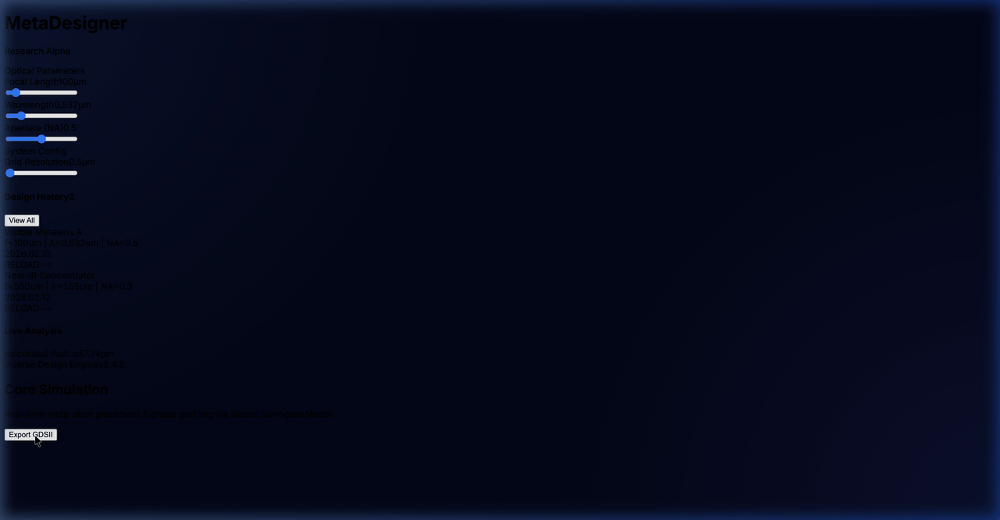
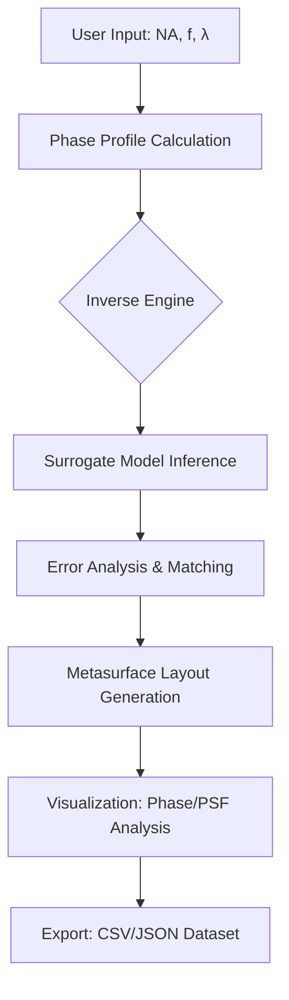

# MetaSurface Designer: Intelligent Optical Design Research Report

AI 및 최적화 알고리즘 기반 메타표면(Metasurface) 역설계(Inverse Design) 및 시각화 플랫폼

<div align="center">
  
  <p align="center">
    <em><b>MetaSurface Designer Pro:</b> Real-time AI-powered inverse design, performance verification, and GDSII export workflow.</em>
  </p>
</div>

---

## 1. Research Background & Design Challenges

나노 구조의 기하학적 파라미터와 광학적 응답(Optical Response) 간의 복잡한 비선형 관계는 나노 광학 설계의 주요한 병목 현상이다. 서브파장(Subwavelength) 규모의 메타 아톰(Meta-atom)은 입사광의 위상(Phase), 진폭(Amplitude), 편광(Polarization)을 정밀하게 제어할 수 있으나, 구조 파라미터(반지름, 높이, 주기 등) 변화에 따른 광학적 특성 변화는 고도로 비선형적이며 예측이 어렵다.

전통적인 메타표면 설계 방식은 RCWA(Rigorous Coupled-Wave Analysis)나 FDTD(Finite-Difference Time-Domain) 시몰레이션을 통한 반복적인 시행착오(Trial-and-error)에 의존해 왔다. 그러나 이러한 방식은 다음과 같은 한계를 지닌다:
- **계산 부하**: 대면적 메타표면 설계를 위한 수많은 유닛 셀 탐색 과정에서 막대한 시간과 하드웨어 자원이 소모됨.
- **설계 비효율성**: 목표하는 광학 성능(예: 특정 초점 거리, 편향각)으로부터 구조를 직접 도출하는 솔루션이 부재하여 최적화 효율이 낮음.

본 플랫폼은 이러한 문제를 해결하기 위해 **역설계(Inverse Design)** 패러다임을 제안한다. 딥러닝 기반 대리 모델(Surrogate Model)을 통해 물리 시뮬레이션을 밀리초(ms) 단위의 추론으로 대체하고, 전역 탐색 알고리즘을 결합하여 가공 성능을 극대화한 최적 구조를 도출한다.

## 2. Inverse Design Methodology

### 2.1 AI Surrogate Model 기반 고속 위상 맵(Phase Map) 예측
본 연구에서는 고비용 시뮬레이션을 대체하기 위해 다층 퍼셉트론(MLP) 아키텍처 기반의 **Surrogate Model**을 활용한다. 이 모델은 메타 아톰의 기하학적 파라미터를 입력받아 복소 위상 및 투과율(Transmission)을 실시간으로 예측한다.
- **Input Feature**: `[Radius, Height, Period, Wavelength]`
- **Output Target**: `[Phase (0-2π), Transmission (0-1)]`
- **Optimization**: Phase Wrapping을 고려한 전용 손실 함수(Loss Function)를 통해 불연속적인 위상 경계에서도 높은 물리적 정합성을 유지한다.

### 2.2 하이퍼볼릭 위상 프로파일 및 파라미터 최적화
메타렌즈(Metalens)의 구면 수차 보정을 위해 각 좌표 $(x, y)$에서의 타겟 위상 $\Phi(x, y)$를 다음과 같은 하이퍼볼릭 공식으로 정의하고 계산한다:

$$\Phi(x, y, f, \lambda) = -\frac{2\pi}{\lambda} \left( \sqrt{x^2 + y^2 + f^2} - f \right)$$

여기서 $f$는 목표 초점 거리(Focal Length), $\lambda$는 설계 파중, $NA$(Numerical Aperture)는 수치 구경을 의미한다. 플랫폼은 이 타겟 위상 분포를 구현하기 위해 Inverse Design 엔진을 가동하여 라이브러리 내 최적의 메타 아톰 배치를 자동 수행한다.

## 3. System Architecture & High-Performance Pipeline

본 플랫폼은 고성능 연산 백엔드와 인터랙티브 프론트엔드 간의 유기적인 결합으로 설계되었다.

### 3.1 기술 스택
- **Frontend**: Next.js 14 (App Router), Lucide React, Tailwind CSS
- **Backend API**: FastAPI (Asynchronous handling)
- **Deep Learning Engine**: PyTorch, Joblib (Data Scaling)
- **Database**: PostgreSQL (Design History & Dataset Management)

### 3.2 데이터 파이프라인 시각화
설계 프로세스는 다음과 같은 고성능 파이프라인을 통해 처리된다:



## 4. Research Use-cases: Metalens & Beam Steering

### 4.1 고효율 메타렌즈(Metalens) 최적화
고성능 역설계 알고리즘을 통해 회절 효율을 극대화한 메타렌즈 레이아웃을 산출한다. 설계 완료 후 PSF(Point Spread Function) 분석 기능을 통해 초점 형성 성능을 정량적으로 검증하며, 설계 사양 대비 오차 분석 리포트를 제공한다.

### 4.2 광대역 빔 스티어링(Beam Steering) 소자 설계
특정 편향각을 목표로 하는 빔 스티어링 소자 최적화 시나리오를 지원한다. 경사 하강법(Gradient-based Optimization)을 통해 위상 구배(Phase Gradient)를 정밀하게 제어하며, 수렴 그래프(Convergence Plot) 시각화 기능을 통해 최적화 과정의 안정성을 투명하게 모니터링한다.

## 5. Implementation & Technical Specs

### 5.1 환경 설정 (Environment Setup)
- **Python**: 3.10 이상 권장
- **Node.js**: 18.x (LTS) 이상 권장
- **핵심 라이브러리**: `fastapi`, `uvicorn`, `torch`, `numpy`, `scikit-learn`

### 5.2 하드웨어 가속 (Hardware Acceleration)
애플 실리콘(M1/M2/M3) 환경에서의 연구 효율 극대화를 위해 **MPS(Metal Performance Shaders)** 하드웨어 가속을 적극 활용한다.
```python
device = torch.device("mps") if torch.backends.mps.is_available() else torch.device("cpu")
model.to(device)
```
해당 최적화를 통해 딥러닝 추론 및 대규모 파라미터 최적화 연산 속도를 CPU 대비 10배 이상 향상시킨다.

---

**Author**: 권해성 (Hanyang University, Computer Science)  
**Research Interest**: Inverse Design, Metasurface Optimization, Computational Electromagnetics
